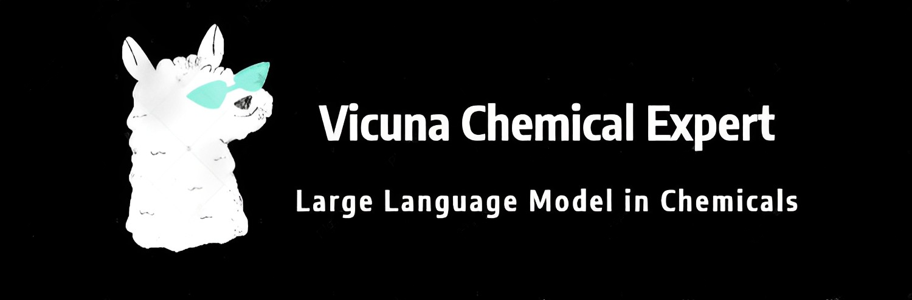
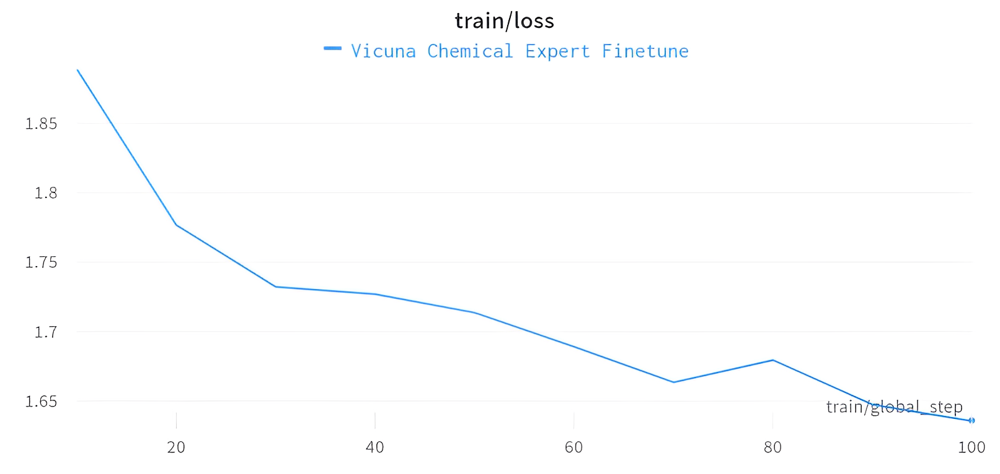
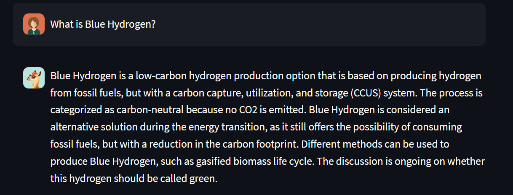
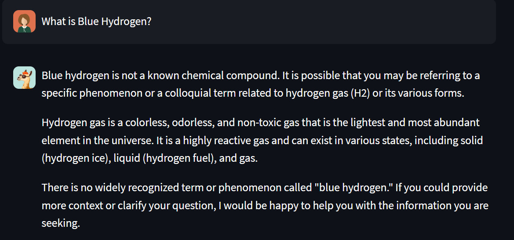
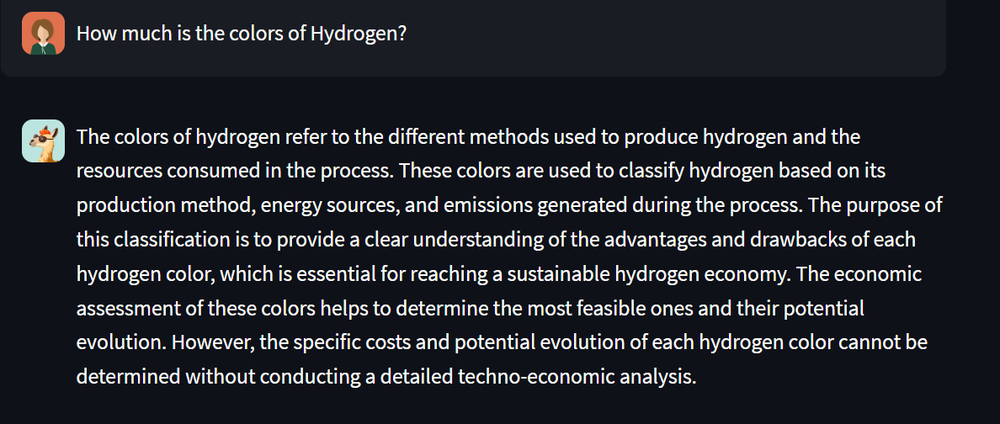
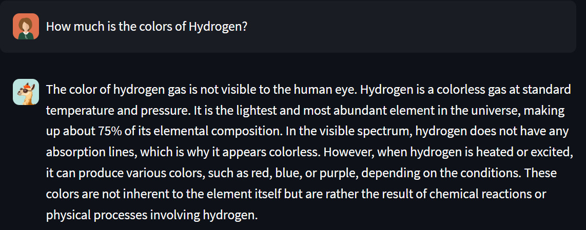

# Vicuna-Chemical-Expert
<p align="center">
    <br>
    
    <br>
</p>

## Update Logs
* 2023.8.15: Create Chatbot_v2
  
  * Add features: **Langchain, ChromaDB(VetcorDB)**
  * Toggle switch for searching **Hydrogen paper**
  
* 2023.7.30: Create Chatbot_v1 

   * Adding Multiple Models: **Chemical, Physics, Mathematics**
   * Create Streamlit app
## Introduction
This is the repo for Vicuna Chemical Expert, which can help to solve some chemical questions. This model was finetuned by the **sharded version** of **lmsys/vicuna-7b-v1.3**, and it can be trained on **4x V100 32GB**.

## Finetune
* Use **Qlora tuning** in Peft
* Vicuna 7B was finetuned based on **chemistry** and **chemical industry** domain.
* **Parameters** available in training

| trainable params | all params | trainable% |
|:----------------:|:----------:|:----------:|
|     13107200     | 6685086720 |   0.1961   |
* When training is done, **merge lora** back to base model
* Below is the finetuning train/loss graph (**Weights & Biases**):
<p>
    <br>
    
    <br>
</p>

* **HuggingFace for Chemical**: [FelixChao/vicuna-7B-chemical](https://huggingface.co/FelixChao/vicuna-7B-chemical)
* **HuggingFace for Coder**: [FelixChao/vicuna-33b-coder](https://huggingface.co/FelixChao/vicuna-33b-coder)

## Setup
To inference this model on your local

* Create development environment and activate
```sh
conda create -n vicuna-chemical python=3.10 
conda activate vicuna-chemical
```
* Download Chatbot_v1 or Chatbot_v2
* Install dependencies
```sh
pip install -r requirements.txt
```
* Run streamlit app
```sh
streamlit run app.py
```

Note: Please make sure that your gpu RAM (**at least 16GB**) is enough for loading model, avoid CUDA Out Of Memory(**OOM**).

## Inference
### Model Inference
```py
from transformers import AutoTokenizer, AutoModelForCausalLM
tokenizer = AutoTokenizer.from_pretrained("FelixChao/vicuna-7B-chemical")
model = AutoModelForCausalLM.from_pretrained("FelixChao/vicuna-7B-chemical",device_map="auto")

encoding = tokenizer(example_text, return_tensors="pt").to("cuda:0")
output = model.generate(input_ids=encoding.input_ids, attention_mask=encoding.attention_mask, max_new_tokens=512, do_sample=True, eos_token_id=tokenizer.eos_token_id)
predict = tokenizer.decode(output[0], skip_special_tokens=True)
```
### Pipeline inference(Faster)
```py
# Use a pipeline as a high-level helper
from transformers import pipeline

pipe = pipeline("text-generation", model="FelixChao/vicuna-7B-chemical")
```
## Vector Database
* Using **ChromaDB** and **LangChain** to create 4 similarity searches in (Hydrogen)Papers.
* This feature can improve the incomplete dataset in which the base model was trained, creating an augmented dataset.
* Below is a demo that can see the difference between **VectorDB** and **not**.

### Blue Hydrogen Problem
**With** ChromaDB ✅:
<p align="center">
    <br>
    
    <br>
</p>

**Without** ChromaDB ❌:
<p align="center">
    <br>
    
    <br>
</p>

### Hydrogen Colors Problem
**With** ChromaDB ✅:
<p align="center">
    <br>
    
    <br>
</p>

**Without** ChromaDB ❌:
<p align="center">
    <br>
    
    <br>
</p>


From the above examples which is the **latest data**, we can see that when the finetuned model is **connected** with the vector database, it will generate the answer better than **without connection**.

## Demo
<p align="center">
    <br>
    
    <br>
</p>

We ask a question about photosynthesis, it can also give the corresponding chemical formula.
